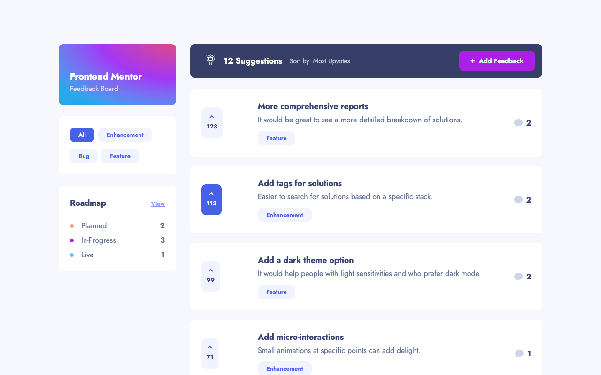
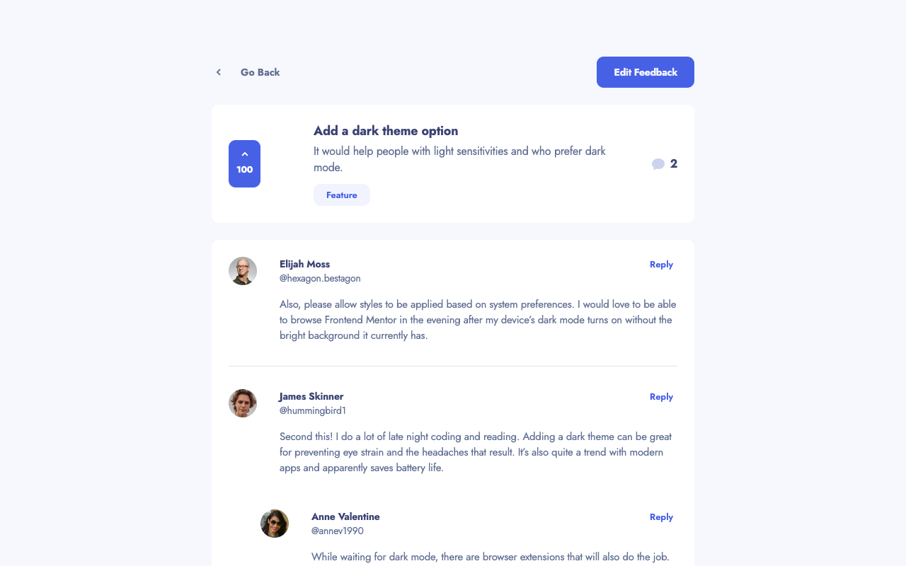

# Product feedback app

Working app is accessible at [demo page](https://product-feedback-dbatishchev.netlify.app/)

### Built with

- Typescript
- React
- Redux & Redux Toolkit
- React Router
- React Beautiful DnD
- Formik
- CSS Modules
- CSS custom properties
- Flexbox & CSS Grid

### Users could:

- Create, read, update, and delete product feedback requests
- Receive form validations when trying to create/edit feedback requests
- Sort suggestions by most/least upvotes and most/least comments
- Filter suggestions by category

- Add comments and replies to a product feedback request
- Upvote product feedback requests

- Change statuses of feedback requests on the interactive board

